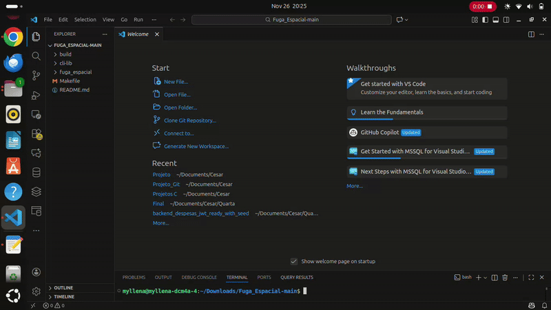
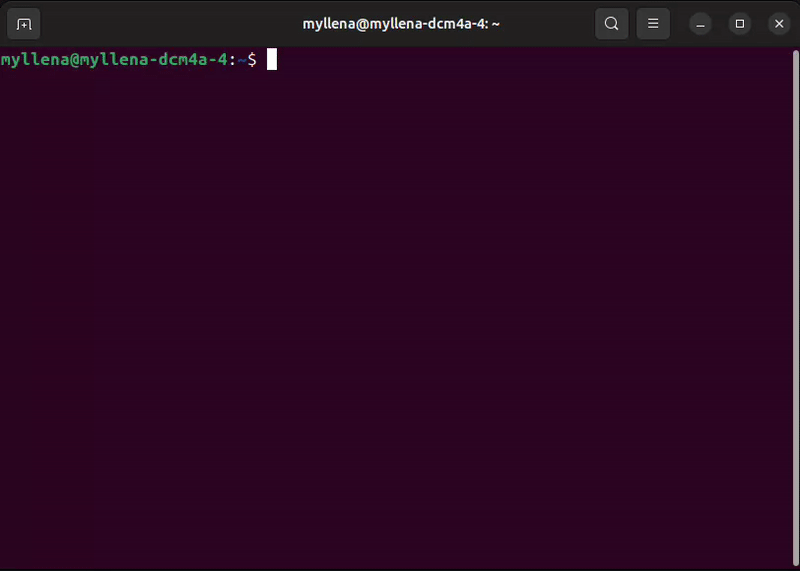

# 🚀 Fuga Espacial

**Fuga Espacial** é um jogo em C, executado no terminal, desenvolvido como projeto acadêmico para praticar lógica de programação, estruturas, modularização, alocação dinâmica e uso de bibliotecas externas.
O jogador controla uma nave que deve desviar de meteoros enquanto a dificuldade aumenta progressivamente.

---

## 🎯 Objetivo do Projeto

Este projeto foi desenvolvido com o intuito de praticar:

✅ Estruturas (struct)

✅ Modularização com múltiplos arquivos (.c e .h)

✅ Alocação dinâmica de memória

✅ Listas encadeadas (para os meteoros)

✅ Gerenciamento de vidas e pontuação

✅ Sistema de níveis progressivos

✅ Uso da biblioteca CLI-LIB para:

  - controle de teclado

  - renderização no terminal

---

## 📁 Estrutura do Projeto

fuga_espacial/

├── build/                  # pasta de saída do executável

├── src/                    # código-fonte principal

│   ├── main.c              # loop principal do jogo

│   ├── jogo.c              # lógica, desenho e mecânicas do jogo

│   ├── jogo.h              # protótipos das funções e includes

│   ├── estruturas.h        # definição das structs

│   ├── nave.c / nave.h     # controle da nave

│   ├── meteoro.c / meteoro.h # meteoros e colisões

│   ├── tiro.c / tiro.h     # tiros da nave

│   ├── vidas.c / vidas.h   # gerenciamento de vidas

│   ├── placar.c / placar.h # pontuação

│   ├── nivel.c / nivel.h   # sistema de níveis

│   └── borda.c / borda.h   # desenho da borda da tela

├── cli-lib/                # biblioteca auxiliar para CLI

│   ├── include/            # screen.h, keyboard.h, timer.h

│   └── src/                # implementações da biblioteca

└── Makefile                # script de compilação

---

## 🧠 Mecânica do Jogo

### Controles

| Tecla    | Ação                |
| -------- | ------------------- |
| `A`      | Mover para esquerda |
| `D`      | Mover para direita  |
| `W`      | Mover para cima     |
| `S`      | Mover para baixo    |
| `Espaço` | Atirar              |
| `ESC`    | Encerrar o jogo     |

---
## Mecânicas adicionais

- Meteoros caem em posições aleatórias e aumentam a velocidade a cada nível.

- O jogador possui um número limitado de vidas.

- Ao atingir determinada pontuação, o nível aumenta e o jogo fica mais difícil.

- Colisão entre a nave e um meteoro remove uma vida.

- O jogo termina quando as vidas acabam.

- Animações de “LEVEL UP” e sons indicam progresso.

## ✅ Funcionalidades Implementadas

| Status | Funcionalidade                                                     |
| ------ | ------------------------------------------------------------------ |
| ✅      | Nave controlável no terminal                                       |
| ✅      | Meteoros caindo e se movendo pela tela                             |
| ✅      | Sistema de tiro da nave                                            |
| ✅      | Sistema de níveis baseado na pontuação                             |
| ✅      | Pontuação aumenta ao desviar ou destruir meteoros                  |
| ✅      | Sistema de vidas da nave                                           |
| ✅      | Colisão entre nave e meteoro encerra o jogo quando as vidas acabam |

---

## 🧪 Como Compilar e Executar

Se você estiver usando o VSCode ou outro IDE no Linux, basta abrir a pasta fuga_espacial e rodar:

make run

O Makefile compila todos os arquivos do projeto e executa o jogo.

## 🎬 Demonstração do Jogo
- No VsCode

- No terminal

